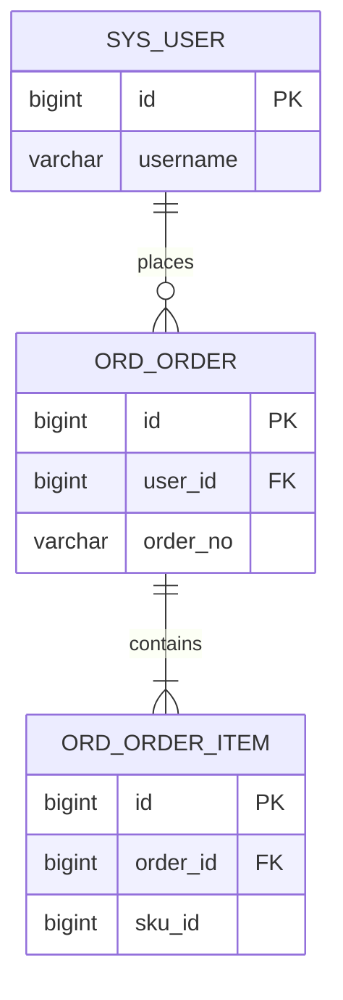

# 数据库设计文档

> 填写说明：将 `【】` 中的占位内容替换为实际信息；不适用的章节可标注「无」或删除。  
> 建议随代码仓库维护，版本变更时同步更新「变更记录」。

| 项目 | 内容 |
|------|------|
| 项目名称 | 【项目名称】 |
| 文档版本 | 【v1.0.0】 |
| 数据库类型 | 【MySQL 8.0 / PostgreSQL 15 / …】 |
| 字符集 / 排序规则 | 【utf8mb4 / utf8mb4_general_ci】 |
| 编写人 | 【姓名 / 团队】 |
| 编写日期 | 【YYYY-MM-DD】 |
| 审核人 | 【姓名】 |
| 审核日期 | 【YYYY-MM-DD】 |

---

## 1. 概述

### 1.1 文档目的

描述本系统数据库的结构、表关系、字段含义、索引与脚本管理方式，供开发、测试、运维及后续接手团队使用。

### 1.2 数据库清单

| 库名 | 用途 | 环境 | 备注 |
|------|------|------|------|
| 【db_xxx】 | 【业务主库】 | 开发/测试/预发/生产 | |
| 【db_xxx_log】 | 【日志库】 | 生产 | 【如无可删】 |

### 1.3 环境连接信息（脱敏）

> 密码、密钥请放在密钥管理系统或单独的《账号交接清单》中，**不要**写入本文档明文。

| 环境 | 主机/地址 | 端口 | 库名 | 账号（角色） | 配置位置 |
|------|-----------|------|------|--------------|----------|
| 开发 | 【host】 | 3306 | 【db】 | 【app_dev / 读写】 | 【Nacos / .env / K8s Secret】 |
| 测试 | | | | | |
| 预发 | | | | | |
| 生产 | | | | | |

### 1.4 中间件与配套组件

| 组件 | 版本 | 用途 | 备注 |
|------|------|------|------|
| 【MySQL】 | 【8.0.xx】 | 主存储 | |
| 【Redis】 | 【7.x】 | 缓存 | 【如有】 |
| 【Flyway / Liquibase】 | 【版本】 | 结构迁移 | 【如有】 |

---

## 2. 设计约定

### 2.1 命名规范

| 类型 | 规范 | 示例 |
|------|------|------|
| 库名 | 【小写 + 下划线】 | `order_center` |
| 表名 | 【小写 + 下划线，业务前缀】 | `ord_order` |
| 字段名 | 【小写 + 下划线】 | `created_at` |
| 主键 | 【id / 表名_id】 | `id` |
| 索引 | 【idx_表_字段 / uk_表_字段】 | `idx_ord_order_user_id` |
| 唯一索引 | 【uk_…】 | `uk_ord_order_no` |

### 2.2 通用字段约定

| 字段名 | 类型 | 说明 |
|--------|------|------|
| `id` | BIGINT | 主键，【雪花 / 自增】 |
| `created_at` | DATETIME | 创建时间 |
| `updated_at` | DATETIME | 更新时间 |
| `created_by` | VARCHAR(64) | 创建人（如有） |
| `updated_by` | VARCHAR(64) | 更新人（如有） |
| `is_deleted` | TINYINT | 逻辑删除：0-否，1-是（如有） |
| `version` | INT | 乐观锁版本号（如有） |

### 2.3 其他约定

- 金额字段单位：【分 / 元】，类型：【BIGINT / DECIMAL(18,2)】
- 时间统一存储：【DATETIME / TIMESTAMP】，时区：【Asia/Shanghai / UTC】
- 枚举字段：【用 TINYINT + 字典表 / 用 VARCHAR】
- 软删除策略：【说明】
- 分库分表策略：【无 / 按 user_id 取模 / ShardingSphere 规则说明】

---

## 3. 库表总览

### 3.1 表清单

| 序号 | 表名 | 中文名 | 模块 | 预估行数级 | 说明 |
|------|------|--------|------|------------|------|
| 1 | 【sys_user】 | 用户表 | 系统 | 万级 | 系统登录用户 |
| 2 | 【ord_order】 | 订单表 | 订单 | 百万级 | 主订单 |
| 3 | | | | | |

### 3.2 ER 关系说明

> 可粘贴 ER 图链接，或使用 Mermaid / 图片附件。



### 3.3 核心表关系

| 父表 | 子表 | 关联字段 | 关系 | 删除策略 |
|------|------|----------|------|----------|
| 【sys_user】 | 【ord_order】 | user.id → order.user_id | 1:N | 【限制删除 / 级联 / 应用层处理】 |
| | | | | |

---

## 4. 表结构明细

> 每张业务表复制一节填写。视图、临时表、中间表也需列出。

### 4.1 【sys_user】— 用户表

| 项目 | 内容 |
|------|------|
| 表名 | `sys_user` |
| 中文名 | 用户表 |
| 所属模块 | 系统管理 |
| 存储引擎 | InnoDB |
| 字符集 | utf8mb4 |
| 说明 | 存放系统登录用户基本信息 |

#### 字段定义

| 字段名 | 类型 | 必填 | 默认值 | 主键 | 唯一 | 索引 | 说明 |
|--------|------|------|--------|------|------|------|------|
| id | BIGINT | 是 | | PK | | | 主键 |
| username | VARCHAR(64) | 是 | | | UK | | 登录名 |
| password | VARCHAR(128) | 是 | | | | | 密码哈希，算法【BCrypt】 |
| mobile | VARCHAR(20) | 否 | NULL | | | IDX | 手机号 |
| status | TINYINT | 是 | 1 | | | | 状态：0-禁用，1-启用 |
| created_at | DATETIME | 是 | CURRENT_TIMESTAMP | | | | 创建时间 |
| updated_at | DATETIME | 是 | CURRENT_TIMESTAMP | | | | 更新时间 |
| is_deleted | TINYINT | 是 | 0 | | | | 逻辑删除 |

#### 索引定义

| 索引名 | 类型 | 字段 | 说明 |
|--------|------|------|------|
| PRIMARY | 主键 | id | |
| uk_sys_user_username | 唯一 | username | 登录名唯一 |
| idx_sys_user_mobile | 普通 | mobile | 按手机号查询 |

#### 枚举 / 字典值

| 字段 | 值 | 含义 |
|------|----|------|
| status | 0 | 禁用 |
| status | 1 | 启用 |

#### 示例数据（脱敏）

```sql
-- 仅作结构示意，勿包含真实敏感信息
INSERT INTO sys_user (id, username, password, mobile, status)
VALUES (1, 'admin', '***', '138****0000', 1);
```

#### 备注

- 【特殊约束、触发器、分区、历史归档策略等】

---

### 4.2 【ord_order】— 订单表

| 项目 | 内容 |
|------|------|
| 表名 | `ord_order` |
| 中文名 | 订单表 |
| 所属模块 | 订单 |
| 存储引擎 | InnoDB |
| 字符集 | utf8mb4 |
| 说明 | 主订单信息 |

#### 字段定义

| 字段名 | 类型 | 必填 | 默认值 | 主键 | 唯一 | 索引 | 说明 |
|--------|------|------|--------|------|------|------|------|
| id | BIGINT | 是 | | PK | | | 主键 |
| order_no | VARCHAR(32) | 是 | | | UK | | 订单号 |
| user_id | BIGINT | 是 | | | | IDX | 下单用户 ID，关联 sys_user.id |
| amount | BIGINT | 是 | 0 | | | | 订单金额，单位：分 |
| status | TINYINT | 是 | 0 | | | IDX | 见枚举 |
| created_at | DATETIME | 是 | CURRENT_TIMESTAMP | | | IDX | 创建时间 |
| updated_at | DATETIME | 是 | CURRENT_TIMESTAMP | | | | 更新时间 |

#### 索引定义

| 索引名 | 类型 | 字段 | 说明 |
|--------|------|------|------|
| PRIMARY | 主键 | id | |
| uk_ord_order_no | 唯一 | order_no | 订单号唯一 |
| idx_ord_order_user_id | 普通 | user_id | 用户订单列表 |
| idx_ord_order_status_created | 联合 | status, created_at | 按状态与时间筛选 |

#### 枚举 / 字典值

| 字段 | 值 | 含义 |
|------|----|------|
| status | 0 | 待支付 |
| status | 1 | 已支付 |
| status | 2 | 已取消 |
| status | 3 | 已完成 |

#### 状态流转

```text
待支付(0) → 已支付(1) → 已完成(3)
    ↓
 已取消(2)
```

#### 备注

- 【超时未支付自动取消规则等】

---

### 4.3 【表名】— 【中文名】

（按需继续复制本节）

---

## 5. 视图 / 存储过程 / 函数 / 触发器

| 类型 | 名称 | 用途 | 依赖表 | 备注 |
|------|------|------|--------|------|
| 视图 | 【v_xxx】 | | | 【无则填「无」】 |
| 存储过程 | | | | |
| 函数 | | | | |
| 触发器 | | | | |

> 若存在，请在附件或仓库路径中提供完整 DDL：`【docs/sql/routines.sql】`

---

## 6. 脚本与迁移管理

### 6.1 脚本清单

| 脚本 | 路径 | 说明 | 执行顺序 |
|------|------|------|----------|
| 建库脚本 | 【docs/sql/01_create_database.sql】 | 创建库与账号权限 | 1 |
| 建表脚本 | 【docs/sql/02_schema.sql】 | 全量 DDL | 2 |
| 初始化数据 | 【docs/sql/03_init_data.sql】 | 字典、角色、管理员等 | 3 |
| 迁移工具 | 【db/migration/V1__xxx.sql】 | Flyway/Liquibase | 按版本号 |

### 6.2 迁移规范

- 工具：【Flyway / Liquibase / 手工 SQL】
- 命名：【V{版本}__{描述}.sql】
- 原则：【只增不改已发布脚本；回滚策略说明】
- 生产变更流程：【评审 → 备份 → 执行 → 校验】

### 6.3 备份与恢复

| 项目 | 说明 |
|------|------|
| 备份策略 | 【每日全量 + binlog / 云厂商自动备份】 |
| 保留周期 | 【30 天】 |
| 恢复演练 | 【是否做过、最近一次日期】 |
| 联系人 | 【DBA / 运维】 |

---

## 7. 权限与安全

| 项目 | 说明 |
|------|------|
| 应用账号权限 | 【仅 DML，无 DDL；或说明例外】 |
| 管理账号 | 【谁持有、如何交接】 |
| 敏感字段 | 【password、mobile、id_card 等】 |
| 加密方式 | 【应用层加密 / 数据库 TDE / 字段级 AES】 |
| 脱敏要求 | 【日志与导出不得落明文】 |

---

## 8. 性能与容量（可选但建议）

| 表名 | 当前数据量 | 增长预估 | 热点查询 | 优化措施 |
|------|------------|----------|----------|----------|
| 【ord_order】 | 【约 200 万】 | 【日增 1 万】 | 用户订单列表 | 【user_id 索引 / 归档】 |
| | | | | |

慢查询与监控：【慢 SQL 阈值、监控平台地址】

---

## 9. 已知问题与技术债

| 序号 | 问题描述 | 影响 | 规避/临时方案 | 计划 |
|------|----------|------|---------------|------|
| 1 | 【某表缺少索引】 | 列表慢 | 限制分页深度 | 下版本补索引 |
| 2 | | | | |

---

## 10. 附件与仓库路径

| 附件 | 路径或链接 |
|------|------------|
| 全量 DDL | 【docs/sql/02_schema.sql】 |
| 初始化数据 | 【docs/sql/03_init_data.sql】 |
| ER 图源文件 | 【docs/er/xxx.drawio】 |
| 数据字典导出 | 【docs/数据库数据字典.xlsx】（如有） |

---

## 11. 变更记录

| 版本 | 日期 | 作者 | 变更说明 |
|------|------|------|----------|
| v1.0.0 | 【YYYY-MM-DD】 | 【姓名】 | 初稿 |
| v1.1.0 | | | 【新增 xxx 表 / 修改 xxx 字段】 |

---

## 附录 A：单表填写速查（复制用）

```markdown
### 4.x 【table_name】— 【中文名】

| 项目 | 内容 |
|------|------|
| 表名 | `` |
| 中文名 | |
| 所属模块 | |
| 存储引擎 | InnoDB |
| 字符集 | utf8mb4 |
| 说明 | |

#### 字段定义

| 字段名 | 类型 | 必填 | 默认值 | 主键 | 唯一 | 索引 | 说明 |
|--------|------|------|--------|------|------|------|------|
| | | | | | | | |

#### 索引定义

| 索引名 | 类型 | 字段 | 说明 |
|--------|------|------|------|
| | | | |

#### 枚举 / 字典值

| 字段 | 值 | 含义 |
|------|----|------|
| | | |

#### 备注

-
```

## 附录 B：交付检查清单

- [ ] 所有业务表均已列入「表清单」并有明细
- [ ] 主键、唯一约束、外键/逻辑外键已说明
- [ ] 枚举字段值域完整
- [ ] 建表 + 初始化 + 迁移脚本路径正确且可执行
- [ ] 环境连接与账号已脱敏，密钥已另册交接
- [ ] ER 图与核心关系已提供
- [ ] 敏感字段与加密方式已说明
- [ ] 变更记录已更新到当前版本
